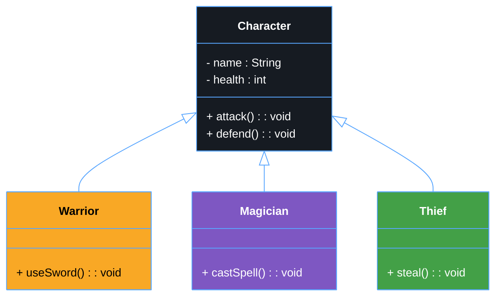

# 🧬 Java Inheritance

Java **Inheritance** is a mechanism where one class (called the *subclass* or *child class*) can acquire the properties and behaviors (fields and methods) of another class (called the *superclass* or *parent class*).  
It helps in **code reusability**, **method overriding**, and **polymorphism**.

---

## 🧠 Concept Overview

- **Superclass (Parent Class)** → The class whose features are inherited.  
- **Subclass (Child Class)** → The class that inherits from another class.  
- **Keyword:** `extends`

➡️ **Syntax:**

```java
class Parent {
    void display() {
        System.out.println("Parent class method");
    }
}

class Child extends Parent {
    void show() {
        System.out.println("Child class method");
    }
}

public class Main {
    public static void main(String[] args) {
        Child obj = new Child();
        obj.display(); // Inherited from Parent
        obj.show();    // Defined in Child
    }
}
```

## ⚙️ UML Diagram – Character Inheritance Example



### 💡 Explanation

**In this UML diagram:**

Character is the base class (superclass).

Warrior, Magician, and Thief are subclasses that inherit from Character.

Each subclass can have its own methods, but also share the common behaviors defined in the superclass.

This is how Java Inheritance allows you to create a hierarchy of classes with shared logic and specialized behavior .

#### 🚀 Advantages of Inheritance

✅ *Code reusability*
✅ *Reduces redundancy*
✅ *Enables polymorphism*
✅ *Improves maintainability*

## ⚙️ Section 2 – Method Overriding in Java

### 🧠 Concept

**Method Overriding** occurs when a **subclass** provides its **own implementation** of a method that is already defined in its **parent class**.  
This allows the subclass to **customize or extend** the behavior inherited from the superclass.

✅ **Rules of Overriding**:

- The method must have the **same name**, **return type**, and **parameters**.
- It must be defined **inside a subclass**.
- The method in the parent class must **not be `final` or `static`**.
- The access level in the subclass **cannot be more restrictive** than in the parent.

---

### 🧩 UML Diagram – Method Overriding Example

```mermaid
%%{init: {'theme': 'neutral', 'themeVariables': {
  'primaryColor': '#1f6feb',
  'edgeLabelBackground':'#ffffff',
  'fontSize': '14px',
  'lineColor': '#58a6ff',
  'primaryTextColor': '#ffffff',
  'tertiaryColor': '#161b22',
  'background': '#0d1117'
}}}%%

classDiagram
class Character {
  + attack() : void
}

class Warrior {
  + attack() : void
}

Character <|-- Warrior

note for Character "General attack method"
note for Warrior "Overrides attack() with sword behavior"

style Character fill:#161b22,stroke:#58a6ff,stroke-width:1px,color:#fff
style Warrior fill:#f9a825,stroke:#58a6ff,stroke-width:1px,color:#000

