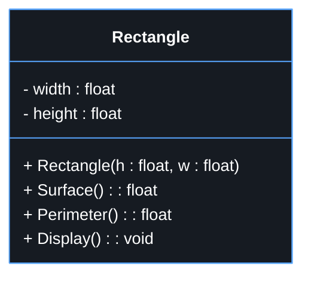

# 🧱 Objects and Classes in Java

## 📘 What is a Class?

A **class** is an **abstract type** that defines **properties (attributes)** and **behaviors (methods)**.  
It acts as a **blueprint** for creating **objects**.

### 🧩 Class Syntax


```java
class ClassName {
    // Class body
}
```
### 🧮 Example
```java

class Rectangle {
    // Attributes
    double width = 11.0;
    double height = 7.0;

    // Method
    double surface() {
        return (width * height);
    }
}
```
---
## 🧍‍♂️ Object (Instance of a Class)
An **object** is a **concrete instance** of **a class**.
It is created from the **class blueprint**.

## 🧩 Syntax
```java
ClassName objectName = new ClassName();
```
### 🧮 Example
```java
Rectangle R1 = new Rectangle();

```
---
## 🧭 UML Representation of a Class
In **UML (Unified Modeling Language)**, a class is represented as a rectangle divided into three compartments:

1.*Class name*

2.*Attributes*

3.*Methods*


# 🔒 Access Modifiers (Encapsulation)


| Access Level | Symbol | Description |
|--------------|--------|-------------|
| **private**   | `-`   | Accessible only within the same class |
| **protected** | `#`   | Accessible in the class and its subclasses |
| **public**    | `+`   | Accessible from anywhere |
| **default**   | _(none)_ | Accessible within the same package |

---

# 🏗️ Class Constructor

A **constructor** is a special method:

- It is **automatically called** when an object is created.
- It helps **initialize the attributes** of the class.

### 🧩 Constructor Rules

- It has the **same name** as the class.
- It has **no return type**.
- A class can have **multiple constructors** (overloading).
- If no constructor is defined, Java provides a **default one**.

### 🧮 Example

```java
class Rectangle {
    double width;
    double height;

    // Default constructor
    public Rectangle() {
        width = 1.0;
        height = 1.0;
    }

    // Parameterized constructor
    public Rectangle(double w, double h) {
        width = w;
        height = h;
    }

    double surface() {
        return width * height;
    }
}

// Object creation
Rectangle R1 = new Rectangle();          // Default constructor
Rectangle R2 = new Rectangle(4.1, 7.3); // Parameterized constructor
