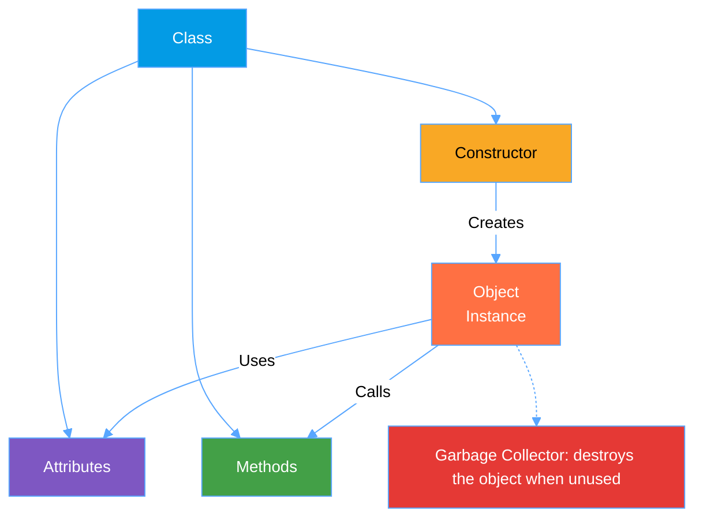

# 🧱 Objects and Classes in Java

## 📘 What is a Class?

A **class** is an **abstract type** that defines **properties (attributes)** and **behaviors (methods)**.  
It acts as a **blueprint** for creating **objects**.

### 🧩 Class Syntax


```java
class ClassName {
    // Class body
}
```
### 🧮 Example
```java

class Rectangle {
    // Attributes
    double width = 11.0;
    double height = 7.0;

    // Method
    double surface() {
        return (width * height);
    }
}
```
---
## 🧍‍♂️ Object (Instance of a Class)
An **object** is a **concrete instance** of **a class**.
It is created from the **class blueprint**.

## 🧩 Syntax
```java
ClassName objectName = new ClassName();
```
### 🧮 Example
```java
Rectangle R1 = new Rectangle();

```
---
## 🧭 UML Representation of a Class
In **UML (Unified Modeling Language)**, a class is represented as a rectangle divided into three compartments:

1.*Class name*

2.*Attributes*

3.*Methods*


# 🔒 Access Modifiers (Encapsulation)


| Access Level | Symbol | Description |
|--------------|--------|-------------|
| **private**   | `-`   | Accessible only within the same class |
| **protected** | `#`   | Accessible in the class and its subclasses |
| **public**    | `+`   | Accessible from anywhere |
| **default**   | _(none)_ | Accessible within the same package |

---

# 🏗️ Class Constructor

A **constructor** is a special method:

- It is **automatically called** when an object is created.
- It helps **initialize the attributes** of the class.

### 🧩 Constructor Rules

- It has the **same name** as the class.
- It has **no return type**.
- A class can have **multiple constructors** (overloading).
- If no constructor is defined, Java provides a **default one**.

### 🧮 Example

```java
class Rectangle {
    double width;
    double height;

    // Default constructor
    public Rectangle() {
        width = 1.0;
        height = 1.0;
    }

    // Parameterized constructor
    public Rectangle(double w, double h) {
        width = w;
        height = h;
    }

    double surface() {
        return width * height;
    }
}

// Object creation
Rectangle R1 = new Rectangle();          // Default constructor
Rectangle R2 = new Rectangle(4.1, 7.3); // Parameterized constructor
```
# 🧹 Class Destructor

Java does **not use destructors** like C++.  
Memory is automatically managed by the **Garbage Collector**.

You can, however, define a `finalize()` method to free resources (e.g., closing a file or database connection).

### 🧮 Example

```java
class Rectangle {
    double width;
    double height;

    public Rectangle(double w, double h) {
        width = w;
        height = h;
    }

    // Destructor method
    @Override
    protected void finalize() {
        System.out.println("Finalizing object Rectangle: " + this);
    }
}
```
---
### ✨ Summary

>A **class** defines structure and behavior.

>An **object** is an instance of that class.

>The **constructor** initializes the object.

>The **garbage collector** automatically destroys it when no longer used.

# 🚗 Car Class in Java

## 📘 Class Description
The `Car` class represents a simple vehicle with some attributes and methods:

- **Attributes**: `brand`, `color`, `year`  
- **Constructor**: Initializes the attributes  
- **Method**: `displayInfo()` prints all car details  

---

## 🧮 Java Code Example

```java
class Car {
    // Attributes
    String brand;
    String color;
    int year;

    // Constructor
    public Car(String b, String c, int y) {
        brand = b;
        color = c;
        year = y;
    }

    // Method
    void displayInfo() {
        System.out.println("🚗 Brand: " + brand);
        System.out.println("🎨 Color: " + color);
        System.out.println("📅 Year: " + year);
        System.out.println("---------------------------");
    }
}

// Main program
public class Main {
    public static void main(String[] args) {
        Car car1 = new Car("Toyota", "Red", 2021);
        Car car2 = new Car("BMW", "Black", 2023);

        car1.displayInfo();
        car2.displayInfo();
    }
}
```
```mermaid 
%%{init: {'theme': 'neutral', 'themeVariables': {
  'primaryColor': '#1f6feb',
  'edgeLabelBackground':'#ffffff',
  'fontSize': '14px',
  'lineColor': '#58a6ff',
  'primaryTextColor': '#ffffff',
  'tertiaryColor': '#161b22',
  'background': '#0d1117'
}}}%%

classDiagram
class Car {
    - brand : String
    - color : String
    - year : int
    + Car(brand : String, color : String, year : int)
    + displayInfo() : void
}

style Car fill:#161b22,stroke:#58a6ff,stroke-width:1px,color:#fff
