## 🧠 What is Java?

**Java** is a powerful, **object-oriented programming** language developed by **Sun Microsystems** (now owned by Oracle).  
It is one of the most popular languages in the world — used to build **desktop**, **web**, **mobile**, and **enterprise** applications.  

### 🔑 Key Features

### 🔴 **Simple**
> ✔ No pointers  
> ✔ No multiple inheritance  
Java is easy to learn and understand, especially for beginners.

---

### 🟢 **Robust**
> 💡 Includes a **Garbage Collector**  
> ⚙️ Provides strong **memory management**  
Java is designed to eliminate error-prone situations by emphasizing early checking for possible errors.

---

### 🟣 **Secure**
> 🧱 Virus-free systems  
> 🔐 No explicit memory access  
Java provides a secure execution environment with built-in security features.

---

### 🔵 **Portable**
> 🧭 Runs on any platform  
> 💻 “Write Once, Run Anywhere”  
Java programs can execute across different systems without modification.

---

### 🟠 **Multi-threaded**
> ⚡ Supports concurrent execution  
> 🔄 Splits tasks into threads running simultaneously  
Ideal for building responsive and high-performance applications.

---

### 🔴 **Dynamic**
> 🔁 Classes can be loaded and updated dynamically  
> 🧩 Supports runtime polymorphism  
Java programs can adapt and evolve without recompilation.

---

### 🟢 **Distributed**
> 🌐 Access files and resources from any machine on the network  
> 🤝 Facilitates distributed computing  
Java is designed for network-based applications and remote object communication.

---

🧩 **In summary:**  
Java is **Simple**, **Robust**, **Secure**, **Portable**, **Multi-threaded**, **Dynamic**, and **Distributed** — a true all-rounder programming language 💪

---
## ⚙️ Java Architecture

```mermaid
%%{init: {'theme': 'neutral', 'themeVariables': {
  'primaryColor': '#1f6feb',
  'edgeLabelBackground':'#ffffff',
  'fontSize': '14px',
  'lineColor': '#58a6ff',
  'primaryTextColor': '#ffffff',
  'tertiaryColor': '#161b22',
  'background': '#0d1117'
}}}%%

flowchart LR
    A["📄 File.java<br/>(Source Code)"]
    B["🧩 JAVAC<br/>(Compiler)"]
    C["📦 File.class<br/>(Bytecode)"]
    D["⚙️ JVM<br/>(Java Virtual Machine)"]
    E["💻 Hardware / OS<br/>(Binary Code 1001000101)"]

    A -->|Compilation| B
    B -->|Generates| C
    C -->|Executed by| D
    D -->|Runs on| E   
    
    style A fill:#161b22,stroke:#58a6ff,stroke-width:1px,color:#ffffff
    style B fill:#f9a825,stroke:#58a6ff,stroke-width:1px,color:#000
    style C fill:#7e57c2,stroke:#58a6ff,stroke-width:1px,color:#fff
    style D fill:#039be5,stroke:#58a6ff,stroke-width:1px,color:#fff
    style E fill:#43a047,stroke:#58a6ff,stroke-width:1px,color:#fff 
```

 ---
   
## 🖥️ JVM Internal Architecture (Detailed)
- **JVM (Java Virtual Machine)**: The runtime environment that executes Java bytecode.  
- **Method Area**: Stores class definitions, method information, and constants.  
- **Heap**: Memory area where objects are stored.  
- **Stack**: Holds local variables and method call frames.  
- **Garbage Collector (GC)**: Automatically frees memory of objects no longer in use.  
- **Native Method Stack (JNI)**: Executes native code called from Java.  
- **Execution Flow**: Shows how the JVM components interact to execute a program.
```mermaid
%%{init: {'theme': 'neutral', 'themeVariables': {
  'primaryColor': '#1f6feb',
  'edgeLabelBackground':'#ffffff',
  'fontSize': '14px',
  'lineColor': '#58a6ff',
  'primaryTextColor': '#ffffff',
  'tertiaryColor': '#161b22',
  'background': '#0d1117'
}}}%%

flowchart TD
    A["⚙️ JVM"]
    B["🗂️ Method Area<br/>(Class info, constants)"]
    C["📦 Heap<br/>(Objects)"]
    D["🧵 Stack<br/>(Local variables & method calls)"]
    E["🔄 Garbage Collector"]
    F["💻 Native Method Stack<br/>(JNI)"]
    G["📝 Execution Flow"]

    %% Connections
    A --> B
    A --> C
    A --> D
    D --> C
    C --> E
    A --> F
    D --> G
    F --> G
    B --> G
    C --> G

    %% Styles
    style A fill:#039be5,stroke:#58a6ff,stroke-width:1px,color:#fff
    style B fill:#7e57c2,stroke:#58a6ff,stroke-width:1px,color:#fff
    style C fill:#43a047,stroke:#58a6ff,stroke-width:1px,color:#fff
    style D fill:#f9a825,stroke:#58a6ff,stroke-width:1px,color:#000
    style E fill:#e53935,stroke:#58a6ff,stroke-width:1px,color:#fff
    style F fill:#ff7043,stroke:#58a6ff,stroke-width:1px,color:#fff
    style G fill:#6d4c41,stroke:#58a6ff,stroke-width:1px,color:#fff
